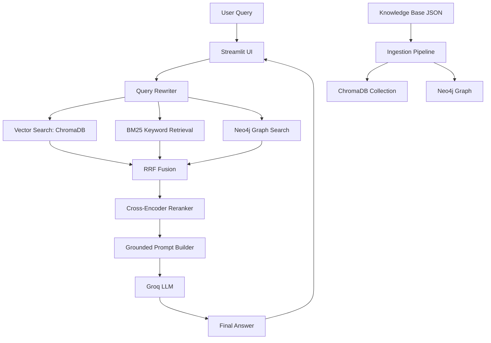

# Features and Architecture

## Product Features

### 1. Hybrid Retrieval Engine
The system retrieves relevant evidence from multiple sources in parallel:

- ChromaDB semantic vector search
- BM25 sparse keyword matching
- Neo4j graph-based relationship exploration
- Reciprocal Rank Fusion (RRF) to combine rankings

This hybrid pattern improves recall and improves resilience when a single retrieval method fails.

### 2. Cross-Encoder Reranking
After fusion, the system re-evaluates results using a cross-encoder model:

- `cross-encoder/ms-marco-MiniLM-L-6-v2`

This ranking step increases relevance by re-scoring the combined candidate list against the user query and keeping only the strongest context chunks.

### 3. Query Rewriting
Follow-up questions are rewritten using the last few interactions to better match the underlying intent.

Example:

- User: “What about the pricing?”
- Context: previous conversation mentioned “Bastian Food Menu”
- Rewritten query: “What are the prices for the Bastian Food Menu?”

This keeps conversational queries grounded and more accurate.

### 4. Answer Synthesis with Guardrails
The synthesizer builds a strict prompt that instructs the LLM:

- answer only from the retrieved context
- never invent prices, policies, or booking details
- refuse unsupported questions with a fixed template
- include citations using source metadata
- respect the current language and tone of the user query

### 5. Diagnostics and Transparency
A diagnostic panel exposes:

- original query
- rewritten query sent to the database
- engine used
- number of retrieved chunks
- preview of context snippets

This helps evaluate retrieval behavior and debug poor answers.

### 6. Local Knowledge Ingestion
The ingestion module loads structured hospitality facts from JSON and prepares them for retrieval.

This architecture supports future addition of document sources without reworking the application logic.

### 7. Safety-Oriented Fallbacks
The model is built to refuse unsupported answers, including:

- live availability
- booking actions
- payment links
- reservation modifications
- real-time inventory

The locally defined refusal templates are explicit and intentionally defensive.

---

## System Architecture

## Component Breakdown

### Frontend Layer

#### `app.py`
Responsibilities:

- initialize the Streamlit interface
- cache RAG components once per session
- display conversation history
- run retrieval and answer generation for each user prompt
- show diagnostics and retrieval status in the sidebar

### Retrieval Layer

#### `src/retrieval/query_rewriter.py`
Responsibilities:

- refine user queries using the conversation context
- preserve raw greeting behavior
- avoid unnecessary rewriting for simple or ambiguous user messages

#### `src/retrieval/hybrid_retriever.py`
 Responsibilities:

- connect to ChromaDB
- build BM25 index from stored chunks
- connect to Neo4j if available
- query vector DB and BM25 in parallel
- perform graph lookup with entity keywords
- combine via reciprocal rank fusion
- rerank using cross-encoder
- return only the strongest chunks to the generator

### Generation Layer

#### `src/generation/synthesizer.py`
Responsibilities:

- convert retrieved context into a structured prompt
- incorporate short conversation history
- call Groq LLM
- enforce constraints from the rulebook
- return answer and engine metadata

### Configuration Layer

#### `src/config.py`
Responsibilities:

- read environment variables from `.env`
- set LLM defaults and database paths
- load dynamic thresholds from the raw knowledge JSON
- centralize configuration for the project

### Ingestion Layer

#### `src/ingestion/document_processor.py`
Responsibilities:

- load the knowledge JSON file
- convert venue info into vector chunks
- store documents in ChromaDB
- optionally ingest graph relations into Neo4j

## Data Flow

### 1. Ingestion
The ingestion process loads a rulebook and converts it into retrieval-friendly chunks:

- venue highlights become high-level vectors
- policy documents become structured knowledge entries
- menu prices and dishes become searchable chunks
- event calendars are inserted as event-related documents

### 2. Query Step
A user query is first rewritten. The system then searches for similar content across all active retrieval engines.

### 3. Reranking
The fused result list is compressed and improved using the cross-encoder model.

### 4. Generation
The top retrieved chunks are inserted into a strict prompt template. The model answers only from those facts.

### 5. Validation
The answer is expected to follow the guardrails in the JSON knowledge base, especially around:

- low-confidence answers
- contradiction checks
- missing information
- citation enforcement

---

## Technology Interaction

### Groq Models
The system uses:

- `llama-3.1-8b-instant` for query rewriting
- `llama-3.3-70b-versatile` for reasoning and answer generation

### Embeddings
The vector database uses the open-source embedding model:

- `all-MiniLM-L6-v2`

### Graph Retrieval
If Neo4j is available, the retriever uses relationship-based extraction by matching entity words from the user query with graph nodes and relation edges.

### BM25
BM25 helps catch exact lexical terms and supported phrases, making the assistant more robust for direct policies and menu names.

## Architectural Strengths

- modular separation of concerns
- hybrid data access improves answer quality
- grounded prompt design reduces hallucinations
- streamlit UX makes the app easy to demo and test
- retrieval diagnostics simplify evaluation

## Architectural Weaknesses

- tightly coupled to a curated local knowledge base
- not production-ready for live operational use
- no persistent user data or authentication layer
- no full monitoring, deployment, or scaling pipeline
- depends on external API access for Groq and optional Neo4j services

## Summary

The architecture is a strong demonstration of a grounded hospitality chatbot using hybrid retrieval and LLM generation. It is optimized for accurate, safe answers in a controlled domain while making the retrieval process transparent and auditable.
